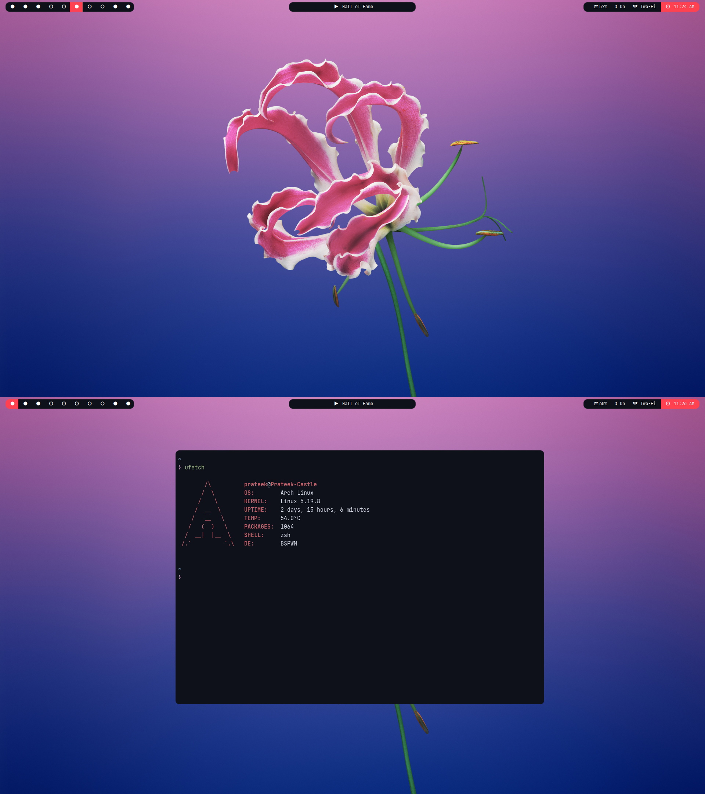

[Material Oceanized](https://github.com/material-ocean) themes and configuration
for most programs I use.

## Requirements

- \*NIX system
- [Zsh](https://github.com/robbyrussell/oh-my-zsh/wiki/Installing-ZSH)
- [Tmux](https://github.com/tmux/tmux)

- required programs

  - [RoundedSBE](https://github.com/a-parhom/RoundedSBE) (rounded corners)
  - [Colloid-light](https://dl.prateekpunetha.dev/stuff/Colloid-light.tar)
    (theme)
  - [Virtual Desktop Bar widget](https://aur.archlinux.org/packages/plasma5-applets-virtual-desktop-bar-git)
    (bar)
  - [touchegg](https://archlinux.org/packages/extra/x86_64/touchegg/) (touchpad
    gestures)
  - [unclutter](https://archlinux.org/packages/extra/x86_64/unclutter/) (hides
    cursor when not in use)

* Icons

  > - [Tela](https://aur.archlinux.org/packages/tela-icon-theme-git)

* Fonts

  > - [San Francesco Display](https://github.com/AppleDesignResources/SanFranciscoFont)
  >   (UI font)
  > - [JetBrains Mono Nerd Font](https://aur.archlinux.org/packages/nerd-fonts-jetbrains-mono/)
  >   (Monospaced Font)

## Installation

- `git clone --recurse-submodules https://github.com/prateekpunetha/dotfiles ~/.dotfiles`
- `cd ~/.dotfiles`
- `./install.sh` to install everything (including fonts).

## keyboard shortcuts

you can change default shortcuts from system settings > shortcuts.

| key                    | function                                                   |
| ---------------------- | ---------------------------------------------------------- |
| alt + super            | Launch KRunner                                             |
| super + w              | launch browser (default is chromium)                       |
| super + Enter          | launch terminal (default is kitty)                         |
| super + f              | launch file manager (default is dolphin)                   |
| super + t              | launch telegram                                            |
| super + v              | launch clipboard                                           |
| super + q              | kill current window                                        |
| super + space          | set window to tiled                                        |
| alt + space            | set window to floating                                     |
| super + F11            | set window to full screen                                  |
| super + {h,j,k,l}      | focus the window on left, below, above, right respectively |
| super + Tab            | focus last desktop                                         |
| super + 1-0            | move to workspaces                                         |
| super + shift + 1-0    | move window to desktop number 1-0                          |
| ctrl + alt + {h,j,k,l} | contract window on given side                              |
| print                  | take a full screenshot                                     |
| shift + print          | launch spectacle area selection                            |
| alt + print            | take full screenshot after 5 seconds                       |
